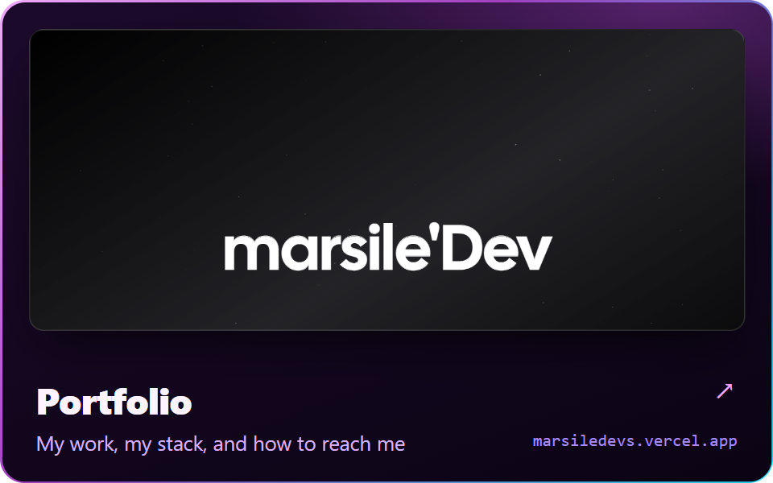
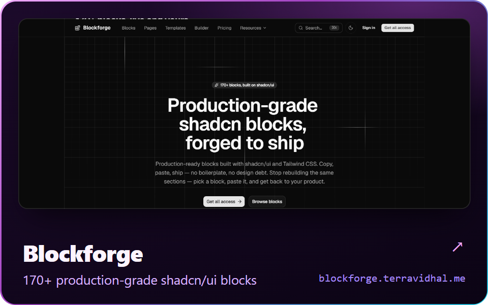
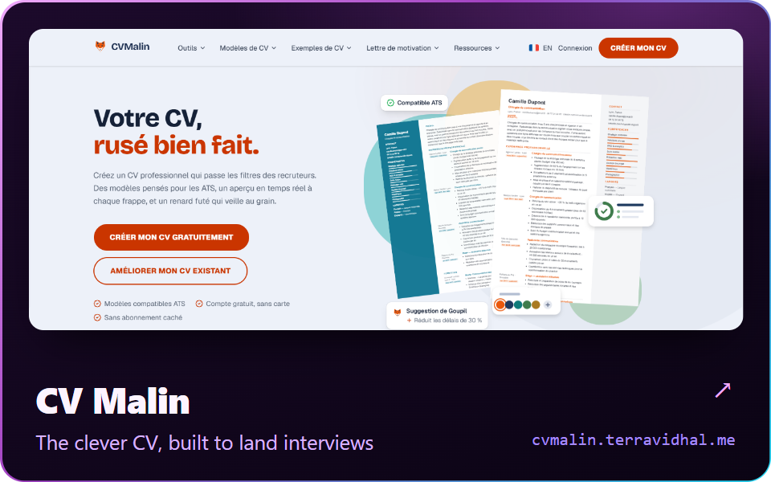
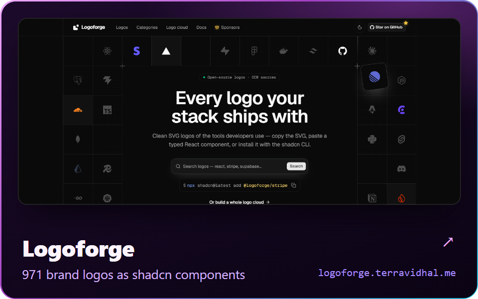

  

<!-- Previous banner (kept for reference):

  

-->

  Fullstack developer — I design, build and ship SaaS products end to end.

 

<picture>
  <source media="(prefers-color-scheme: dark)" srcset="assets/h-stack-dark.svg">
  
</picture>

<table>
  <tr>
    <td><picture><source media="(prefers-color-scheme: dark)" srcset="assets/tiles/label-languages-dark.svg"></picture></td>
    <td align="center"></td>
    <td align="center"></td>
    <td align="center"></td>
    <td align="center"></td>
    <td align="center"></td>
    <td align="center"></td>
    <td></td>
    <td></td>
    <td></td>
    <td></td>
  </tr>
  <tr>
    <td><picture><source media="(prefers-color-scheme: dark)" srcset="assets/tiles/label-frontend-dark.svg"></picture></td>
    <td align="center"></td>
    <td align="center"></td>
    <td align="center"></td>
    <td align="center"></td>
    <td align="center"></td>
    <td></td>
    <td></td>
    <td></td>
    <td></td>
    <td></td>
  </tr>
  <tr>
    <td><picture><source media="(prefers-color-scheme: dark)" srcset="assets/tiles/label-backend-dark.svg"></picture></td>
    <td align="center"></td>
    <td align="center"></td>
    <td align="center"></td>
    <td align="center"></td>
    <td align="center"></td>
    <td align="center"></td>
    <td align="center"></td>
    <td></td>
    <td></td>
    <td></td>
  </tr>
  <tr>
    <td><picture><source media="(prefers-color-scheme: dark)" srcset="assets/tiles/label-databases-dark.svg"></picture></td>
    <td align="center"></td>
    <td align="center"></td>
    <td align="center"></td>
    <td align="center"></td>
    <td align="center"></td>
    <td align="center"></td>
    <td align="center"></td>
    <td></td>
    <td></td>
    <td></td>
  </tr>
  <tr>
    <td><picture><source media="(prefers-color-scheme: dark)" srcset="assets/tiles/label-tools-cloud-dark.svg"></picture></td>
    <td align="center"></td>
    <td align="center"></td>
    <td align="center"></td>
    <td align="center"></td>
    <td align="center"></td>
    <td align="center"></td>
    <td align="center"></td>
    <td align="center"></td>
    <td align="center"></td>
    <td align="center"></td>
  </tr>
</table>

Logos served by <a href="https://logoforge.terravidhal.me">Logoforge</a> — my open-source set of 970+ brand logos for developers.

  

<picture>
  <source media="(prefers-color-scheme: dark)" srcset="assets/h-building-dark.svg">
  
</picture>

<table>
  <tr>
    <td width="50%"></td>
    <td width="50%"></td>
  </tr>
  <tr>
    <td width="50%"></td>
    <td width="50%"></td>
  </tr>
</table>

 

<picture>
  <source media="(prefers-color-scheme: dark)" srcset="assets/h-city-dark.svg">
  
</picture>

  

 

<picture>
  <source media="(prefers-color-scheme: dark)" srcset="assets/h-find-dark.svg">
  
</picture>

  
  &nbsp;
  
  &nbsp;
  

 

  

<!-- Contribution snake (kept for later — the "GitHub Snake Game" workflow still updates it daily):
<picture>
  <source media="(prefers-color-scheme: dark)" srcset="https://raw.githubusercontent.com/terravidhal/terravidhal/output/github-snake-dark.svg" />
  <source media="(prefers-color-scheme: light)" srcset="https://raw.githubusercontent.com/terravidhal/terravidhal/output/github-snake.svg" />
  
</picture>
-->
